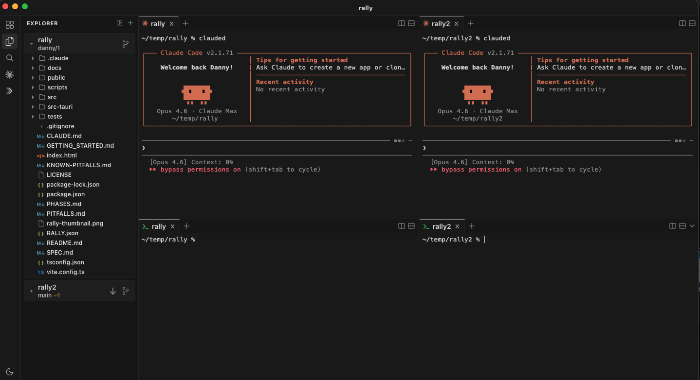

# Rally

A native macOS app for calm, focused agentic development across multiple repos and branches.



## Why Rally?

Agentic development is powerful but chaotic. You end up juggling terminals, repos, branches, and Claude sessions across scattered windows. You lose track of what's running where. Context-switching between projects means losing your place. The noise adds up.

Rally fixes this with one idea: **workspaces**. Each workspace bundles your repos, terminals, Claude sessions, git state, and pane layout into a single switchable context. Switch projects instantly without losing anything. Come back to exactly where you left off.

**What Rally gives you:**

- **Multitask across agents** -- Run multiple Claude Code sessions side by side, each in its own pane, across different repos or branches
- **Two modes** -- **Dev mode** gives you full control with terminals, editors, and split panes. **Product mode** gives you a focused chat interface for Claude Code. Toggle with `Cmd+Shift+M` or **View > Toggle Dev/Product Mode**
- **Multiple checkouts per workspace** -- Clone a repo into a sibling directory to work on multiple branches simultaneously. Right-click any repo in the file explorer and select **New Checkout**
- **Switch projects without losing state** -- Every workspace preserves its terminal sessions, pane layout, and git context
- **Streamlined git workflow** -- Built-in GUI for staging, committing, rebasing, creating PRs, and reviewing diffs
- **Agent-driven shipping** -- `/ship` commits, pushes, creates a PR, runs a Claude review, and auto-merges if clean -- or flags you if human review is needed
- **CLI shortcuts** -- Rally installs git shortcuts (`gship`, `gmerge`, `gpr`, `grb`, `gsync`, `gfinish`) to `~/.rally/bin/`
- **Claude Code commands** -- Built-in `/ship`, `/review-pr`, `/merge-pr`, and `/create-pr` commands available in every Claude session
- **Scripts & watchers** -- Rally auto-discovers scripts from your repo's `scripts/` directory. Pin them to the bottom status bar for one-click run/stop and live build status. Scripts with "watch" in the name get watcher behavior (colored status dot, build timestamps). See [Scripts & Watchers](GETTING_STARTED.md#7-scripts--watchers) for setup
- **Config at a glance** -- View and edit your `CLAUDE.md` files directly in the app
- **Minimal by design** -- Only shows what you need. No visual clutter, no unnecessary chrome

## Getting Started

**New to Rally?** Read the **[Getting Started guide](GETTING_STARTED.md)** for a walkthrough of all features.

### Prerequisites

- **macOS** (primary target -- Windows/Linux untested)
- **Node.js 22+** -- install via [nodenv](https://github.com/nodenv/nodenv), [nvm](https://github.com/nvm-sh/nvm), or [Homebrew](https://brew.sh) (`brew install node`)
- **Rust** (stable) -- install via [rustup](https://rustup.rs): `curl --proto '=https' --tlsv1.2 -sSf https://sh.rustup.rs | sh`
- **Tauri CLI v2** -- `cargo install tauri-cli --version "^2"`
- **gh CLI** -- `brew install gh` (required for PR operations; authenticate with `gh auth login`)

### Build & Run

```bash
# 1. Clone the repo
git clone https://github.com/ddgonzal3/rally.git
cd rally

# 2. Install frontend dependencies
npm install

# 3. Build and launch the app
./scripts/run.sh
```

This builds the frontend (TypeScript + Vite), compiles the Rust backend, bundles a native `.app`, and opens it.

### Other Build Options

```bash
./scripts/check.sh         # Type-check only (fast, no build artifacts)
./scripts/build.sh         # Build .app bundle without launching
./scripts/build-release.sh # Build .app + .dmg for distribution
```

After building, the app bundle is at:
```
src-tauri/target/release/bundle/macos/Rally.app
```

To install permanently, drag `Rally.app` into `/Applications`.

### Development

For frontend-only iteration with hot reload:

```bash
cargo tauri dev
```

This starts a Vite dev server on port 5173 with hot module replacement. Rust changes still require a full rebuild via `./scripts/run.sh`.

## Keyboard Shortcuts

| Shortcut | Action |
|----------|--------|
| `Cmd+Shift+C` | Open a new Claude Code tab |
| `Cmd+Shift+M` | Toggle Dev/Product mode |
| `Cmd+/` | Split active pane right (new terminal) |
| `` Ctrl+` `` | Toggle bottom panel |
| `Cmd+W` | Close the active tab |
| `Cmd+Shift+[` / `]` | Cycle tabs left/right |
| `Shift+Arrow` | Navigate between pane groups |
| `Cmd+Shift+F` | Search panel (workspace-wide find/replace) |
| `Cmd+P` | Quick open (file picker) |
| `Cmd+E` | Toggle file explorer |
| `Cmd+N` | New file |
| `Cmd+Shift+O` | Add folder to workspace |

See the full list in [Getting Started -- Keyboard Shortcuts](GETTING_STARTED.md#keyboard-shortcuts).

## Tech Stack

| Layer | Technology | Purpose |
|-------|-----------|---------|
| App Shell | **Tauri v2** | Native macOS window, IPC, bundling (.app/.dmg) |
| Frontend | **React 19** + **TypeScript** | UI components, state management |
| Terminal | **xterm.js v6** + **portable-pty** | Real terminal emulation with PTY backend |
| State | **Zustand** | Lightweight reactive state management |
| Editor | **Monaco Editor** | VS Code-quality editing for CLAUDE.md/skills |
| Backend | **Rust** | PTY management, git operations, file system |
| Git | **git CLI** + **gh CLI** | All git operations via subprocess |
| Build | **Vite** + **Cargo** | Frontend bundling + Rust compilation |

## Architecture

```
+-----------------------------------------+
|         React Frontend                  |
|  +----------+  +--------------------+  |
|  | xterm.js |  | Workspace UI       |  |
|  | terminals|  | Git actions        |  |
|  |          |  | File explorer      |  |
|  |          |  | Settings (Monaco)  |  |
|  +----+-----+  +------+-------------+  |
|       | PTY data       | commands      |
+-------+----------------+--------------+
|       |   Tauri IPC    |              |
+-------+----------------+--------------+
|       v                v              |
|  +----------+  +--------------------+ |
|  | PTY      |  | Git / Config /     | |
|  | Manager  |  | Workspace Mgr     | |
|  | (Rust)   |  | (Rust)            | |
|  +----------+  +--------------------+ |
|         Rust Backend                  |
+-----------------------------------------+
```

### How PTY Works

1. Frontend calls `spawn_pty(cwd, command, cols, rows)` -- Rust spawns a real shell process
2. Rust reads PTY stdout on a dedicated thread, emits `pty-output-{id}` events
3. Frontend listens for events, writes raw bytes to xterm.js
4. User keystrokes go from xterm -> `write_pty(id, data)` -> Rust writes to PTY stdin
5. Resize events forwarded via `resize_pty(id, cols, rows)`

### How Git Operations Work

All git operations shell out to `git` and `gh` CLI. No libgit2, no custom git implementation -- just structured wrappers around the real tools. This means:
- Identical behavior to what you'd do in a terminal
- Full compatibility with git hooks, configs, credentials
- `gh` handles GitHub auth via its own credential store

## Project Structure

```
rally/
+-- scripts/                    # Build & run scripts
|   +-- build.sh                # Build .app bundle
|   +-- run.sh                  # Build + launch app
|   +-- build-release.sh        # Build .app + .dmg for distribution
|   +-- check.sh                # Type-check frontend + cargo check
|   +-- reload.sh               # Smart reload (hot-reload or rebuild)
+-- src/                        # React frontend
|   +-- App.tsx                 # Root layout with native titlebar
|   +-- main.tsx                # React entry point
|   +-- components/
|   |   +-- Sidebar.tsx         # Workspace list, git status, settings access
|   |   +-- Terminal.tsx        # xterm.js terminal wired to PTY backend
|   |   +-- PaneGroupView.tsx   # Tab bar, pane content, split controls
|   |   +-- PaneLayout.tsx      # Dynamic split-pane terminal grid
|   |   +-- ProductChatPanel.tsx# Product mode chat interface
|   |   +-- FileExplorer.tsx    # Lazy-loading file tree
|   |   +-- AddWorkspaceModal.tsx  # New workspace form with git auto-detect
|   |   +-- SettingsPanel.tsx   # CLAUDE.md/skills editor with Monaco
|   |   +-- ShipStatusPill.tsx  # Ship progress indicator
|   |   +-- BuildStatusBar.tsx  # Watcher build status in status bar
|   |   +-- BuildStatusDrawer.tsx  # Expandable terminal for script output
|   +-- stores/
|   |   +-- workspaceStore.ts   # Zustand store (workspaces, git, panes)
|   +-- lib/
|       +-- tauri.ts            # Typed Tauri API wrappers
|       +-- types.ts            # Shared TypeScript types
+-- src-tauri/                  # Rust backend
|   +-- src/
|   |   +-- main.rs             # Tauri entry point, command registration
|   |   +-- lib.rs              # Module re-exports
|   |   +-- pty_manager.rs      # PTY lifecycle (spawn, write, resize, kill)
|   |   +-- git_ops.rs          # Git CLI wrapper (status, sync, rebase, push, PR)
|   |   +-- commands.rs         # Workspace CRUD, file listing, git info detection
|   |   +-- config_ops.rs       # CLAUDE.md/skills read/write
|   |   +-- ship_ops.rs         # Ship signal protocol, command install
|   |   +-- workspace.rs        # Workspace data model + JSON persistence
|   +-- Cargo.toml
|   +-- tauri.conf.json         # Tauri window + bundle config
|   +-- capabilities/
|       +-- default.json        # Tauri v2 permissions
+-- CLAUDE.md                   # Agent instructions for this project
+-- PITFALLS.md                 # Accumulated mistake patterns
+-- index.html                  # HTML entry point + theme variables
+-- package.json
+-- tsconfig.json
+-- vite.config.ts
```

## Workspace Data

Workspace configs persist at `~/.rally/workspaces.json`. Each workspace stores:
- Name, paths, repo URLs, branches, main branch
- Process configs (auto-start commands)
